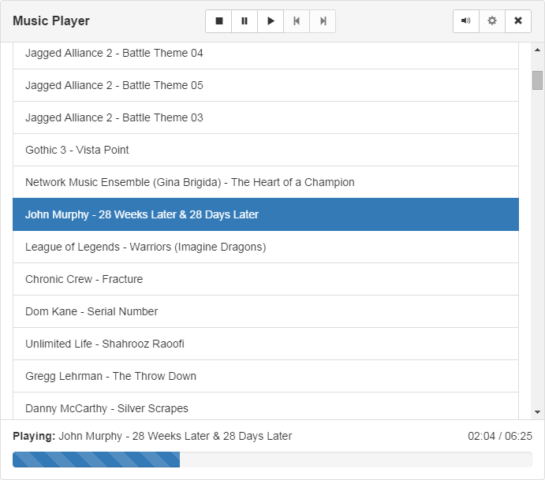

<p align="center">
    
</p>

# Music Player
Unnamed music player running in Node-Webkit. Work in progress!

# How To Run
1. Download [Node-Webkit](https://github.com/rogerwang/node-webkit) (v0.11.5+).
2. Optional: Add Node-Webkit directory to the path.
3. Run Node-Webkit inside project's directory: ``` Music-Player-1501> nw . ```
4. For built in Webkit debugging tools: ``` Music-Player-1501> nw debug ```
